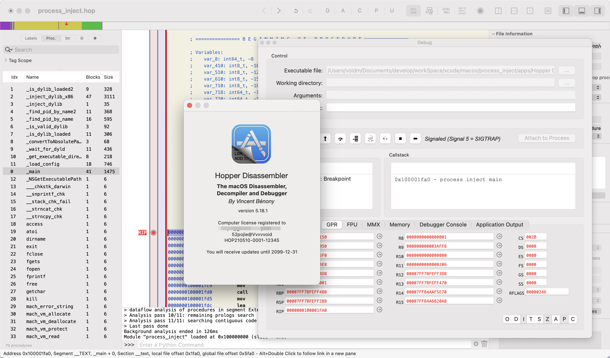

# 🛠 Hopper Disassembler for macOS 5.18.1 [U2B]

[](https://t.me/dylib_dobby_hook_chat)

## 🆕 更新记录

**2025年4月28日**  

- 新增支持 **SIP 开启 (SIP ON)** 的版本，无需关闭系统完整性保护即可运行  
- 不再依赖 `HopperStarter` 启动  

---

- 💻 支持平台：macOS Universal 2 Binary（Intel & Apple Silicon）
- 📦 版本：5.18.1
- 🧬 类型：静态注入版
- 🔐 要求：无



> 🕵️ 致敬原作者精妙的混淆技术与暗桩设计，令人拍案叫绝。包括但不限于  

- 防注入, 签名检测
- 花指令,混淆,关键代码加密
- 防 hook, 核心函数劫持
- 防内存修改...
- ..TODO

> 我想起 ida 9.x 的泄漏版, 以及 大佬开源了 keygen, 所以 patch 无壳,无混淆 (绝逼不是我懒得弄)  

## 🚀 启动方式

1. 正常打开 Hopper Disassembler 应用。
2. 如果遇到**Apple无法验证“Hopper Disassembler.app”是否包含可能危害Mac安全或泄漏隐私的恶意软件提示**,请运行以下命令解除应用的隔离标记：

```bash
/usr/bin/xattr -r -d com.apple.quarantine "/Applications/Hopper Disassembler v4.app"
```

## 🧪 TODO

- 暂无

## ⚠️ 注意事项

- 破解仅供研究与学习使用，禁止用于商业用途
- 此注入方式依赖内存修改，更新后可能失效
- **若转载请注明来源（本贴地址）与作者信息**  

## 🔗 下载链接

[https://github.com/marlkiller/hp_patch](https://github.com/marlkiller/hp_patch)

---

🧠 面向逆向工程、安全研究、动态分析等学习用途，如需源码交流欢迎私信联系。
